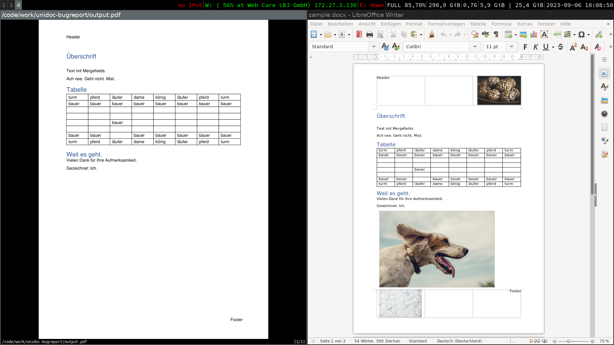

# Sample Usage

Simply run: 
```sh
go run . --name="your license name" --license="----All Your License key----
over multiple lines
and so on"
```

Compare the `sample.docx` with the `output.pdf`.

See the missing images in the `.pdf` which exist in the `.docx`.


